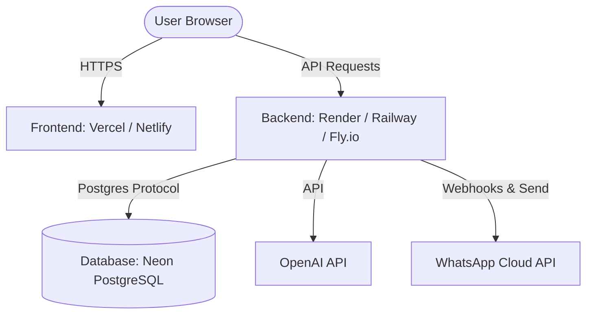

# Deployment Guide for FlowPilot

This guide explains how to deploy the FlowPilot application, with the frontend hosted on **Vercel** or **Netlify** and the backend hosted on **Render**, **Railway**, or **Fly.io**.

---

## Architecture Overview



---

## 1. Database Setup (Neon PostgreSQL)

FlowPilot uses Prisma with a PostgreSQL database. If you already have your Neon database configured (using the connection string in your `.env` files), you can skip to database migration.

If you need to set up a new database:
1. Sign up/Log in to [Neon](https://neon.tech/).
2. Create a new project and select **PostgreSQL**.
3. Copy the **Connection String** from the Neon dashboard.
4. Save this string. It will be used as `DATABASE_URL` in both your backend environment variables and local `.env` files.
   > [!IMPORTANT]
   > Ensure your connection string includes `sslmode=require`.

---

## 2. Backend Deployment

You can deploy the Express backend to **Render**, **Railway**, or **Fly.io**.

### Option A: Render Deployment
1. Log in to [Render](https://render.com/).
2. Click **New +** and select **Web Service**.
3. Connect your Git repository.
4. Configure the service settings:
   - **Name**: `flowpilot-backend` (or similar)
   - **Environment**: `Node`
   - **Root Directory**: `backend` (very important: this isolates the backend workspace)
   - **Build Command**: `npm install && npm run build`
   - **Start Command**: `npm start`
5. Click **Advanced** and add the following **Environment Variables** (see table below).
6. Click **Create Web Service**.

### Option B: Railway Deployment
1. Log in to [Railway](https://railway.app/).
2. Click **New Project** -> **Deploy from GitHub repo**.
3. Select your repository.
4. In the service settings, click on the **Variables** tab and add the Environment Variables.
5. In the **Settings** tab, configure:
   - **Root Directory**: `backend`
   - **Build Command**: `npm install && npm run build`
   - **Start Command**: `npm start`
6. Deploy the service.

### Required Backend Environment Variables

| Variable Name | Description | Example / Recommended Value |
| :--- | :--- | :--- |
| `DATABASE_URL` | PostgreSQL connection string | `postgresql://...` |
| `NODE_ENV` | Environment identifier | `production` |
| `JWT_SECRET` | Secret key for signing authorization tokens | *Random long secure string* |
| `OPENAI_API_KEY` | OpenAI API Key for AI reasoning and embeddings | `sk-proj-...` |
| `WHATSAPP_PHONE_NUMBER_ID` | WhatsApp Business Phone Number ID | Found in Meta App Dashboard |
| `WHATSAPP_ACCESS_TOKEN` | System user permanent access token | Found in Meta App Dashboard |
| `WHATSAPP_VERIFY_TOKEN` | Custom verification string for WhatsApp Webhooks | *Custom secure string* |
| `WHATSAPP_APP_SECRET` | Meta App Secret for payload security verification | Found in Meta App Dashboard |

---

## 3. Database Migration and Seeding

Once the backend service is running and has access to `DATABASE_URL`:

### Running Migrations
Run the following command locally from the `backend/` directory to push your database schema and migrations to the production database:
```bash
# From the backend directory
npx prisma migrate deploy
```
*Alternatively, you can run `npm run db:migrate` in the backend directory.*

### Seeding Initial Data
To populate your production database with initial configuration, business info (`Veda Wellness`), and mock documents:
```bash
# From the backend directory
npm run db:seed
```

This will create an initial user for testing:
- **Email**: `admin@vedawellness.com`
- **Password**: `admin123`

---

## 4. Frontend Deployment

You can deploy the React + Vite frontend to **Vercel** or **Netlify**.

### Option A: Vercel Deployment
1. Log in to [Vercel](https://vercel.com/).
2. Click **Add New** -> **Project**.
3. Import your Git repository.
4. Configure project settings:
   - **Framework Preset**: `Vite` (automatically detected)
   - **Root Directory**: `./` (keep root folder, do not set to backend)
   - **Build Command**: `npm run build`
   - **Output Directory**: `dist`
5. Add the following **Environment Variable**:
   - **Key**: `VITE_API_URL`
   - **Value**: The live URL of your deployed backend (e.g., `https://flowpilot-backend.onrender.com`)
     > [!WARNING]
     > Do not append a trailing slash `/` at the end of the URL (e.g., use `https://api.example.com` instead of `https://api.example.com/`).
6. Click **Deploy**.

*Vercel will use the custom `vercel.json` rewrite configuration created in your repository to handle client-side routing rewrites cleanly.*

### Option B: Netlify Deployment
1. Log in to [Netlify](https://www.netlify.com/).
2. Click **Add new site** -> **Import an existing project**.
3. Choose your Git provider and select the repository.
4. Configure build settings:
   - **Base directory**: (leave blank, i.e. root)
   - **Build command**: `npm run build`
   - **Publish directory**: `dist`
5. Add the Environment Variable:
   - **Key**: `VITE_API_URL`
   - **Value**: Your deployed backend URL.
6. Click **Deploy site**.

*Netlify will use the `public/_redirects` file automatically to handle router rewrites.*

---

## 5. Webhook URL Configuration in Meta Developer Portal

To receive real-time messages from WhatsApp, you need to configure webhooks in the Meta App dashboard:
1. Log in to the [Meta App Dashboard](https://developers.facebook.com/).
2. Under products, go to **WhatsApp** -> **Configuration**.
3. Set the **Callback URL** to:
   `https://<your-backend-domain>/api/webhooks`
4. Set the **Verify Token** to match the value of `WHATSAPP_VERIFY_TOKEN` you set in the backend environment variables.
5. Click **Verify and Save**.
6. Under Webhook Fields, subscribe to **messages**.
